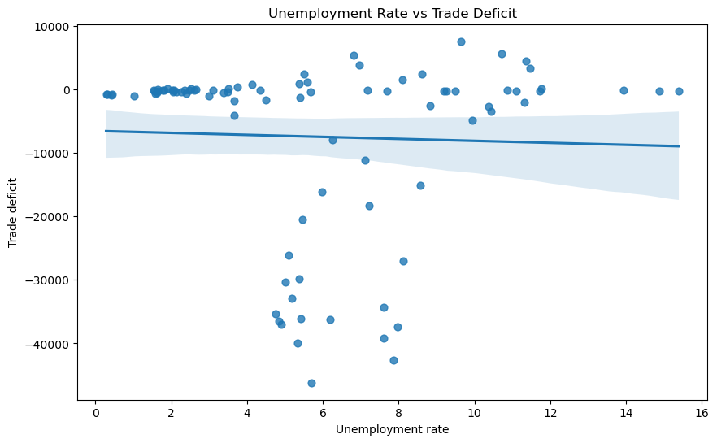

[Home](../index.html) | [Blog](index.html) | [Pandas Groupby Recipe](pandas-groupby-recipe.html) | [Macroeconomic Data Project](macroeconomic-data-project.html)

# Exploring a Millennium of Macroeconomic Data with Python

## Introduction
Macroeconomic data is interesting because it connects numbers to big historical and policy questions. Instead of focusing on one company or one short period, macro data lets us study broad patterns in unemployment, trade, prices, and growth over long stretches of time. For this project, I worked with the **A Millennium of Macroeconomic Data** dataset from Kaggle and used Python to explore how major economic indicators relate to each other.

What made this project interesting to me is that macroeconomic variables often sound intuitive on their own, but once you compare them directly, the relationships are not always what you expect. A graph may suggest a pattern at first glance, but a more careful statistical summary can show that the relationship is weak, noisy, or heavily influenced by outliers. That made this project a good fit for a data science workflow: gather the data, clean it, visualize it, compute statistics, and interpret the results carefully.

## Motivating Question
My main question was:

**Is there a meaningful relationship between unemployment rate and trade deficit in this dataset?**

I chose this question because both variables are frequently discussed in economics and public policy. It is easy to assume that labor market weakness and trade imbalance should move together in some obvious way, but that is exactly the kind of assumption data analysis can test.

More broadly, I wanted to see how far I could get by taking a large public macroeconomic dataset and turning it into something interpretable with a simple exploratory workflow in Pandas, Matplotlib, and Seaborn.

## Data Ethics and Allowable Use
This project used a **publicly available dataset hosted on Kaggle**, so I did not scrape any website or collect private information. That made the ethics side of this project more straightforward than a web scraping project.

My checklist was simple:

- confirm the data was publicly distributed for analysis,
- avoid using personal or sensitive information,
- preserve the meaning of the variables rather than stripping them out of context,
- and avoid making causal claims from observational data.

Because this dataset is historical and aggregate, there were no direct privacy concerns. The main responsibility here was careful interpretation, especially since macroeconomic relationships are influenced by many factors beyond any one pair of variables.

## How to Get Started with a Similar Project
One thing I like about this project is that the starting workflow is simple. If you want to do something similar, here is a practical process:

1. **Find a public dataset with documented variables**  
   Kaggle is a good place to start, especially if the data is already available as CSV files.

2. **Load the data into Pandas**  
   Read the file, inspect the column names, and look at the first few rows.

3. **Choose a focused question**  
   Instead of trying to analyze every variable, pick one pair or a small group of features that leads to a clear question.

4. **Clean only the variables you need first**  
   In my case, I had to make sure the columns I wanted to compare were actually numeric and not stored as strings.

5. **Visualize before modeling**  
   A scatterplot is a fast way to check whether a relationship seems linear, weak, clustered, or dominated by outliers.

6. **Compute summary statistics and correlations**  
   This helps move from “what the graph looks like” to “what the data actually supports.”

7. **Write conclusions cautiously**  
   With observational data, especially macroeconomic data, it is safer to talk about association than causation.

That is enough for someone else to reproduce the overall structure of the project without reading a full log of every debugging step.

## Final Dataset Overview
The original dataset comes from the Bank of England’s **A Millennium of Macroeconomic Data** collection hosted on Kaggle. It contains many macroeconomic indicators across a long historical span, which makes it useful for exploratory analysis of broad economic relationships.

For this project, I focused on a cleaned analysis subset containing the two variables most relevant to my question:

- **Unemployment rate**
- **Trade deficit**

After converting the selected columns to numeric values and dropping rows with missing or invalid values in either field, the final analysis subset used in this post had:

- **88 rows**
- **2 analyzed features**

This means the blog post is based on a focused slice of the larger dataset rather than the full table of all available variables.

### Mini data dictionary
- **Unemployment rate**: the unemployment level associated with each observation in the dataset
- **Trade deficit**: the trade balance measure for the same observation, recorded as deficit values

### Summary statistics

| Variable | Count | Mean | Std. Dev. | Min | Median | Max |
|---|---:|---:|---:|---:|---:|---:|
| Unemployment rate | 88 | 5.75 | 3.62 | 0.28 | 5.38 | 15.39 |
| Trade deficit | 88 | -7427.98 | 14134.14 | -46189 | -378.50 | 7602 |

Even from this summary, the trade deficit variable clearly has a very wide spread and several likely outliers.

## Visualization
Here is the scatterplot used in the analysis:

The line of best fit slopes slightly downward, but the points are widely dispersed. That visual impression already suggests the relationship is probably weak.

## Cleaning and Transformations
The most important cleaning step was converting the selected columns to numeric form. At first, plotting failed or produced unreadable charts because the values were being interpreted as text rather than numbers. Once the columns were converted correctly and missing values were removed, the scatterplot became usable.

The main transformations were:

- selecting the two columns relevant to the question,
- coercing non-numeric values into missing values,
- dropping rows with missing values in either selected field,
- and then computing descriptive statistics and a simple linear regression.

This project was a good reminder that many analysis problems are really data type problems first.

## Findings
After visualizing the data and computing the statistics, the relationship between unemployment rate and trade deficit turned out to be **very weak**.

### Statistical summary
- **Pearson correlation:** -0.040
- **Spearman correlation:** -0.016
- **R-squared:** 0.0016
- **Regression slope:** -156.91
- **p-value:** 0.710

### Interpretation
The scatterplot showed a slight downward trend line, but the actual statistical relationship was extremely small. Both the Pearson and Spearman correlations were close to zero, which suggests there is little meaningful association between these two variables in the cleaned subset. The regression result points in a slightly negative direction, but the p-value is large, so there is no strong evidence of a linear relationship.

In plain terms, **unemployment rate alone does not appear to explain trade deficit very well in this sample**.

That result was still useful. It showed that a visually plausible macroeconomic story can disappear once you actually measure the association.

## Data Quality and Limitations
There are several limitations worth noting:

- **No explicit time variable was included in this specific comparison.**  
  That means I treated the observations as a set of points rather than a historical sequence.

- **Outliers matter a lot.**  
  The trade deficit variable has large negative values that likely influence the spread and the fitted line.

- **Macro variables are context-dependent.**  
  Even if two indicators are important individually, they may not show a strong pairwise relationship without time, policy regime, or other controls.

- **This is not causal analysis.**  
  The results only support statements about association in the available observations.

If I extend this project, the first improvement would be to incorporate a **year or date field** and analyze how these variables move over time rather than only comparing them in a scatterplot.

## Resources and Links
Here are the main resources for the project:

- [Kaggle dataset page](https://www.kaggle.com/datasets/bank-of-england/a-millennium-of-macroeconomic-data/data)
- [Project GitHub repository](https://github.com/mrataeran/uk-macro-analysis)
- [Pandas documentation](https://pandas.pydata.org/)
- [Seaborn documentation](https://seaborn.pydata.org/)

## Conclusion
This project was a good example of why exploratory data analysis matters. I started with a reasonable economic question, cleaned a public dataset, visualized the variables, and then used correlation and regression to test whether the apparent relationship held up. In this case, it mostly did not, which is still a useful result.

For a Stat 386 student, I think this is a strong project pattern to reuse: start with a public dataset, ask a focused question, clean the relevant fields, visualize the relationship, and back up your interpretation with a few simple statistical measures. That workflow is practical, teachable, and easy to extend later.